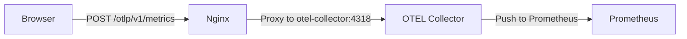

# Keep Observability & Metrics Guide

This document describes the observability architecture implemented in Keep, the metrics available, and how to query them.

## Architecture Overview

The observability stack consists of the following components:

1.  **Keep UI (Frontend)**: Uses OpenTelemetry (OTEL) RUM SDK to send client-side metrics.
2.  **Nginx Proxy**: Acts as a bridge, proxying `/otlp` requests from the browser to the OTEL Collector.
3.  **OTEL Collector**: Receives metrics via OTLP/HTTP and exports them to Prometheus.
4.  **Keep Backend**: Exposes a `/metrics` endpoint for server-side metrics (e.g., incident counts).
5.  **Prometheus**: Scrapes both the OTEL Collector (port 9100) and the Keep Backend (port 8080).

### Data Flow (Client-side)


## Metrics Reference

### Frontend (RUM) Metrics
These metrics are prefixed with `keep_frontend_`.

| Metric Name | Type | Description | Labels |
| :--- | :--- | :--- | :--- |
| `page_load_latency_seconds` | Histogram | Time from component mount to fully loaded state. | `page`, `path`, `preset`, `dashboard_id`, `incident_id` |
| `action_latency_seconds` | Histogram | Duration of user actions (e.g. status change). | `action`, `path` |
| `error_count_total` | Counter | Total count of JS errors and unhandled rejections. | `type`, `message`, `path` |
| `active_user_heartbeat_total` | Counter | 30-second heartbeat for counting active users. | `session_id` |

**Page Labels**: 
- `feed`: Main alerts feed.
- `preset`: Filtered alert views.
- `incidents`: Main incidents list.
- `incident`: Single incident detail page.
- `dashboard`: Dashboard page.

### Backend Metrics
The backend exposes its own metrics via `/metrics`, including:
- `open_incidents_total`: Number of active incidents.
- `alerts_total`: Total number of alerts processed.

## Querying Metrics in Prometheus/Grafana

### 1. Active User Count
To see the number of unique active users/tabs in the last 2 minutes:
```promql
count(count by (session_id) (rate(keep_frontend_active_user_heartbeat_total[2m]) > 0))
```

### 2. Page Load Latency (95th Percentile)
To see how fast pages are loading for users:
```promql
histogram_quantile(0.95, sum by (le, page) (rate(keep_frontend_page_load_latency_seconds_bucket[5m])))
```

### 3. Error Rate
To see the trend of frontend errors:
```promql
sum(rate(keep_frontend_error_count_total[5m])) by (type, message)
```

## Configuration

### Environment Variables (.env.local)
- `NEXT_PUBLIC_OTEL_COLLECTOR_URL`: Set to `http://localhost:4318` for direct access or `/otlp` to use the Nginx proxy.

### OTEL Collector (otel-collector-config.yaml)
The collector uses the `prometheus` exporter to expose metrics for scraping. It is configured to listen for OTLP/HTTP on port 4318.

### Prometheus (prometheus.yaml)
Prometheus scrapes the collector and backend targets:
- `otel-collector:9100`: Collector metrics (including RUM).
- `host.docker.internal:8080`: Keep backend metrics.
