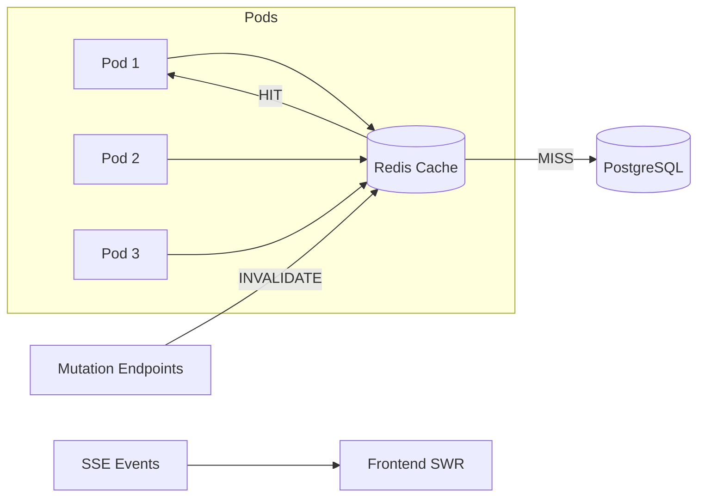

# Add Redis Cache to Keep API

## Problem

Every page load fires multiple DB-heavy API calls with no caching. A dedicated Redis instance will serve as a **shared cache across all pods**.

## Approach: Redis Shared Cache

- **New clean Redis instance** dedicated solely to caching
- Cache key = `cache:{endpoint}:{tenant_id}:{hash(params)}` — shared across all pods and users
- `redis-py` client with `orjson` serialization (already a project dependency)
- TTL-based expiry (Redis handles it natively)
- Graceful fallback: if Redis is down → direct DB query (no errors)

## Endpoints to Cache

| Endpoint | TTL | Invalidated by |
|---|---|---|
| `POST /alerts/query` | 30s | [receive_generic_event](file:///Users/yarin/keep/keep/api/routes/alerts.py#465-514), [enrich_alert](file:///Users/yarin/keep/keep/api/routes/alerts.py#845-883), [batch_enrich_alerts](file:///Users/yarin/keep/keep/api/routes/alerts.py#636-843), [delete_alert](file:///Users/yarin/keep/keep/api/routes/alerts.py#302-370) |
| `POST /alerts/facets/options` | 30s | Same as alerts |
| `GET /providers` | 120s | [install_provider](file:///Users/yarin/keep/keep/api/routes/providers.py#471-536), [delete_provider](file:///Users/yarin/keep/keep/api/routes/providers.py#368-386), [update_provider](file:///Users/yarin/keep/keep/api/routes/providers.py#431-469) |
| `GET /preset` | 300s | [create_preset](file:///Users/yarin/keep/keep/api/routes/preset.py#251-316), [update_preset](file:///Users/yarin/keep/keep/api/routes/preset.py#352-431), [delete_preset](file:///Users/yarin/keep/keep/api/routes/preset.py#318-350) |
| `GET /incidents` | 60s | Incident create/update/delete |

## Proposed Changes

### Cache Module

#### [NEW] [cache.py](file:///Users/yarin/keep/keep/api/core/cache.py)

Central cache module with Redis client, cache get/set/invalidate helpers:

```python
import hashlib, json, logging, os
import redis
import orjson

logger = logging.getLogger(__name__)

CACHE_ENABLED = os.environ.get("CACHE_ENABLED", "true") == "true"
REDIS_HOST = os.environ.get("CACHE_REDIS_HOST", "localhost")
REDIS_PORT = int(os.environ.get("CACHE_REDIS_PORT", 6379))

_redis_client = None

def get_redis_client():
    """Lazy-init Redis client. Returns None if unavailable."""
    global _redis_client
    if not CACHE_ENABLED:
        return None
    if _redis_client is None:
        try:
            _redis_client = redis.Redis(
                host=REDIS_HOST, port=REDIS_PORT, decode_responses=False
            )
            _redis_client.ping()
        except Exception:
            logger.warning("Cache Redis unavailable — caching disabled")
            return None
    return _redis_client

def _make_key(prefix, tenant_id, params):
    param_hash = hashlib.sha256(
        json.dumps(params, sort_keys=True, default=str).encode()
    ).hexdigest()[:16]
    return f"cache:{prefix}:{tenant_id}:{param_hash}"

def get_cached(prefix, tenant_id, params):
    """Return cached response or None on miss."""
    client = get_redis_client()
    if not client:
        return None
    try:
        data = client.get(_make_key(prefix, tenant_id, params))
        if data:
            logger.debug(f"Cache HIT: {prefix}:{tenant_id}")
            return orjson.loads(data)
        logger.debug(f"Cache MISS: {prefix}:{tenant_id}")
        return None
    except Exception:
        logger.warning("Cache read error", exc_info=True)
        return None

def set_cached(prefix, tenant_id, params, data, ttl):
    """Cache a response with TTL in seconds."""
    client = get_redis_client()
    if not client:
        return
    try:
        client.setex(
            _make_key(prefix, tenant_id, params), ttl, orjson.dumps(data)
        )
    except Exception:
        logger.warning("Cache write error", exc_info=True)

def invalidate(prefix, tenant_id):
    """Delete all cache keys for a given prefix + tenant."""
    client = get_redis_client()
    if not client:
        return
    try:
        pattern = f"cache:{prefix}:{tenant_id}:*"
        cursor = 0
        while True:
            cursor, keys = client.scan(cursor, match=pattern, count=100)
            if keys:
                client.delete(*keys)
            if cursor == 0:
                break
        logger.debug(f"Cache invalidated: {prefix}:{tenant_id}")
    except Exception:
        logger.warning("Cache invalidation error", exc_info=True)
```

---

### Cached Endpoints

#### [MODIFY] [alerts.py](file:///Users/yarin/keep/keep/api/routes/alerts.py)

- [query_alerts](file:///Users/yarin/keep/keep/api/routes/alerts.py#183-237): Check cache → on miss, query DB → cache result (TTL 30s)
- [fetch_alert_facet_options](file:///Users/yarin/keep/keep/api/routes/alerts.py#82-122): Same pattern (TTL 30s)
- Invalidate in: [receive_generic_event](file:///Users/yarin/keep/keep/api/routes/alerts.py#465-514), [enrich_alert](file:///Users/yarin/keep/keep/api/routes/alerts.py#845-883), [batch_enrich_alerts](file:///Users/yarin/keep/keep/api/routes/alerts.py#636-843), [delete_alert](file:///Users/yarin/keep/keep/api/routes/alerts.py#302-370)

#### [MODIFY] [providers.py](file:///Users/yarin/keep/keep/api/routes/providers.py)

- [get_providers](file:///Users/yarin/keep/keep/api/routes/providers.py#68-111): Cache response (TTL 120s)
- Invalidate in: [install_provider](file:///Users/yarin/keep/keep/api/routes/providers.py#471-536), [delete_provider](file:///Users/yarin/keep/keep/api/routes/providers.py#368-386), [update_provider](file:///Users/yarin/keep/keep/api/routes/providers.py#431-469)

#### [MODIFY] [preset.py](file:///Users/yarin/keep/keep/api/routes/preset.py)

- [get_presets](file:///Users/yarin/keep/keep/api/routes/preset.py#202-238): Cache response (TTL 300s)
- Invalidate in: [create_preset](file:///Users/yarin/keep/keep/api/routes/preset.py#251-316), [update_preset](file:///Users/yarin/keep/keep/api/routes/preset.py#352-431), [delete_preset](file:///Users/yarin/keep/keep/api/routes/preset.py#318-350)

#### [MODIFY] [incidents.py](file:///Users/yarin/keep/keep/api/routes/incidents.py)

- Incidents listing: Cache response (TTL 60s)
- Invalidate on incident mutations

---

### Configuration

#### [MODIFY] [consts.py](file:///Users/yarin/keep/keep/common/consts.py)

```python
# Cache settings (uses a dedicated Redis instance)
CACHE_ENABLED = os.environ.get("CACHE_ENABLED", "true") == "true"
CACHE_REDIS_HOST = os.environ.get("CACHE_REDIS_HOST", "localhost")
CACHE_REDIS_PORT = int(os.environ.get("CACHE_REDIS_PORT", 6379))
ALERTS_CACHE_TTL = int(os.environ.get("ALERTS_CACHE_TTL", 30))
PROVIDERS_CACHE_TTL = int(os.environ.get("PROVIDERS_CACHE_TTL", 120))
PRESETS_CACHE_TTL = int(os.environ.get("PRESETS_CACHE_TTL", 300))
INCIDENTS_CACHE_TTL = int(os.environ.get("INCIDENTS_CACHE_TTL", 60))
```

> [!NOTE]
> Uses `CACHE_REDIS_HOST` / `CACHE_REDIS_PORT` — separate from any other Redis env vars to avoid conflicts.

### Dependency

#### [MODIFY] [pyproject.toml](file:///Users/yarin/keep/pyproject.toml)

Add `redis >= 5.0` as a direct dependency.

---

## Architecture



## Verification Plan

### Automated Tests
- `tests/test_api_cache.py`:
  - Cache miss → DB query → result cached in Redis
  - Cache hit → returns cached data (no DB call)
  - Mutation → keys invalidated → next read hits DB
  - Redis down → fallback to direct DB query
  - `CACHE_ENABLED=false` → no caching

### Manual Verification
- Compare page load times before/after with browser DevTools
- `X-Cache: HIT/MISS` response header for debugging
